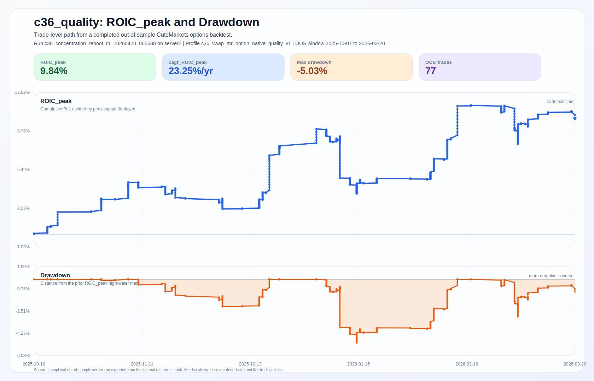

# CuteMarkets Intraday Option Strategies

`cuteoptionstrats` packages one curated intraday options strategy on top of [`cutebacktests`](https://github.com/cutemarkets/cutebacktests). The public surface is intentionally narrow: one named model (`c36_quality`), reproducible backtests, and explicit assumptions for signal generation, option selection, and out-of-sample evaluation.

The default model is the public alias for `c36_vwap_mr_option_native_quality_v1`, a quote-aware `0-2DTE` VWAP mean-reversion options model for liquid U.S. index ETFs. This repository does not re-implement the full backtesting engine. It pins one research branch, exposes a small CLI and Python API, and documents the model and evaluation assumptions explicitly so developers can inspect an intraday options strategy without cloning the private research stack.

Quick links:

- [Read docs](https://cutemarkets.com/docs)
- [Get API key](https://cutemarkets.com/signup)
- [Explore `cutebacktests`](https://github.com/cutemarkets/cutebacktests)
- [Explore `cutemarkets-python`](https://github.com/cutemarkets/cutemarkets-python)

NOTE: This is not our best model, but a solid one.



_Figure: trade-level `ROIC_peak` and drawdown from a completed out-of-sample `server2` run of `c36_vwap_mr_option_native_quality_v1`, using the realized OOS trade window from `2025-10-07` to `2026-03-20`._

## Model In This Repository

- Default model id: `c36_quality`
- Backing profile: `c36_vwap_mr_option_native_quality_v1`
- Signal family: VWAP residual z-score mean reversion
- Instrument expression: single-leg options
- DTE window: `0-2DTE`, target `1DTE`
- Default universe: `SPY`, `QQQ`
- Runtime dependency: [`cutebacktests`](https://github.com/cutemarkets/cutebacktests)

## Explore Examples And Artifacts

- [examples/run_c36_quality.py](examples/run_c36_quality.py)
- [examples/export_trade_log.py](examples/export_trade_log.py)
- [examples/inspect_model_metadata.py](examples/inspect_model_metadata.py)
- [docs/assets/c36-quality-example-trades.csv](docs/assets/c36-quality-example-trades.csv) for the public export shape

## Why This Repo Exists Instead Of Publishing Every Strategy

The purpose of this repository is to publish one concrete model surface with explicit assumptions, not to release the full internal strategy set. That makes the public package more useful for developers because they can inspect one complete model card, one CLI, and one stable API without sorting through a large private research archive.

It also keeps the public contract honest. This repo is meant to show how CuteMarkets thinks about model packaging, quote-aware options backtesting, and out-of-sample reporting. It is not meant to imply that every stronger internal strategy should be public.

## Where `c36` Is Implemented

This repository selects and runs `c36`. The strategy definition itself lives in `cutebacktests`.

| Layer | Location |
| --- | --- |
| Local default alias and model metadata | [src/cuteoptionstrats/models.py](src/cuteoptionstrats/models.py) |
| Local backtester construction | [src/cuteoptionstrats/runtime.py](src/cuteoptionstrats/runtime.py) |
| Local CLI | [src/cuteoptionstrats/cli.py](src/cuteoptionstrats/cli.py) |
| Profile alias lookup (`c36_quality`) | [cutebacktests: opening_range_profiles_registry.py](https://github.com/cutemarkets/cutebacktests/blob/main/src/cutebacktests/profiles/opening_range_profiles_registry.py) |
| Exact profile definition (`c36_vwap_mr_option_native_quality_v1`) | [cutebacktests: opening_range_profiles.py](https://github.com/cutemarkets/cutebacktests/blob/main/src/cutebacktests/profiles/opening_range_profiles.py) |
| Signal construction and exit resolution | [cutebacktests: mean_reversion_intraday.py](https://github.com/cutemarkets/cutebacktests/blob/main/src/cutebacktests/strategies/mean_reversion_intraday.py) |
| Generic options backtester and contract/fill engine | [cutebacktests: intraday_options.py](https://github.com/cutemarkets/cutebacktests/blob/main/src/cutebacktests/backtest/intraday_options.py) |

Operationally, `cuteoptionstrats` is the opinionated entrypoint. `cutebacktests` is the source of truth for the profile, signal engine, option selection, quote handling, and persistence.

## Install

```bash
python3 -m venv .venv
source .venv/bin/activate
python -m pip install -e '.[dev]'
```

## Creating The Data Directory And DuckDB Path

`cuteoptionstrats` accepts repo-scoped path variables and maps them to the underlying `cutebacktests` runtime:

- `CUTEOPTIONSTRATS_DATA_DIR`
- `CUTEOPTIONSTRATS_DB_PATH`

Recommended setup:

```bash
mkdir -p data

cat > .env <<'EOF'
CUTEOPTIONSTRATS_DATA_DIR=data
CUTEOPTIONSTRATS_DB_PATH=data/cuteoptionstrats.duckdb

CUTEMARKETS_API_KEY=your_cutemarkets_key
CUTEMARKETS_BASE_URL=https://api.cutemarkets.com
EOF
```

CuteMarkets is the default API path for this repository. Auxiliary provider support remains available in the runtime, but it is opt-in rather than part of the recommended public setup.

What happens when you run a backtest:

1. `load_settings(".env")` reads `.env` and maps `CUTEOPTIONSTRATS_*` paths onto the `cutebacktests` runtime settings.
2. `Settings.from_env(...)` creates the data directory and the parent directory of the database path if they do not exist.
3. `DataStore(settings.db_path)` opens DuckDB and initializes the schema on first writable access.

This means you do not need to pre-create the DuckDB file manually. Creating the directory is enough. The database file is created on first run.

### What The Data Directory Contains

At minimum, the directory will contain the DuckDB file you configured, for example:

```text
data/
└── cuteoptionstrats.duckdb
```

Depending on your workflow, the database accumulates:

- cached stock bars: `stock_bars`, `stock_daily_bars`, `stock_bar_coverage`
- cached option market data: `option_chain`, `option_bars`, `option_quotes`
- cached contract lookups and selection preferences:
  `option_contract_cache`, `option_contract_list_cache`,
  `option_contract_universe_cache`, `option_contract_fetch_preference`
- generated research artifacts written into the DB:
  `signals`, `backtest_trades`, `paper_orders`

The current public schema is defined in [`cutebacktests/src/cutebacktests/storage.py`](https://github.com/cutemarkets/cutebacktests/blob/main/src/cutebacktests/storage.py).

Practical guidance:

- use one DB per experiment branch if you want isolation
- keep the DB on a local SSD path if you plan to cache large options histories
- do not share one writable DuckDB across unrelated concurrent research jobs

## Python Example

```python
from datetime import datetime

from cuteoptionstrats import build_default_config, build_default_model, load_settings
from cuteoptionstrats.runtime import build_backtester
from cutebacktests.storage import DataStore

settings = load_settings(".env")
model = build_default_model()
store = DataStore(settings.db_path)

try:
    backtester = build_backtester(settings=settings, store=store)
    result = backtester.run(
        build_default_config(
            start=datetime(2025, 1, 1),
            end=datetime(2025, 1, 31),
            ticker="SPY",
            return_trade_log=True,
        )
    )
    print(model.profile_name, result["trades"])
finally:
    store.close()
```

## CLI

Show the default model metadata:

```bash
python -m cuteoptionstrats.cli show-model
```

Run a backtest with the default model:

```bash
python -m cuteoptionstrats.cli run-backtest \
  --ticker SPY \
  --start 2025-01-01 \
  --end 2025-01-31
```

Run the default universe in one shot:

```bash
python -m cuteoptionstrats.cli run-default-universe \
  --start 2025-01-01 \
  --end 2025-01-31
```

Inspect the fully resolved config payload:

```bash
python -m cuteoptionstrats.cli show-effective-config
```

## `c36` Model Specification

### Profile Lineage

`c36_quality` is not a standalone handwritten strategy. It is built by composition:

1. `c4_mr_vwap_zscore_v2`
2. `c4_mr_vwap_zscore_v2_fast`
3. `c18_vwap_mr_balance_v1`
4. `c18_vwap_mr_quality_v1`
5. `c36_vwap_mr_option_native_quality_v1`

That lineage matters because the final profile inherits both the original VWAP z-score logic and the later option-native execution overlay.

### Active Parameters

The final `c36_quality` configuration inherits the following effective settings from the profile chain.

| Parameter | Value | Role |
| --- | --- | --- |
| `strategy_variant` | `mr_vwap_zscore_v2` | use the VWAP residual z-score engine |
| `opening_range_minutes` | `5` | first regular-session bars used only to define early context |
| `entry_start_time` | `09:35` | earliest signal evaluation time |
| `entry_cutoff_time` | `12:00` | no new entries after noon ET |
| `exit_time` | `15:55` | hard intraday exit cutoff |
| `allow_long` | `True` | long mean-reversion entries allowed |
| `allow_short` | `True` | short mean-reversion entries allowed |
| `require_breakout_open_inside_range` | `False` | no ORB-style inside-range gate |
| `require_relative_volume` | `True` | require elevated opening activity |
| `relative_volume_min` | `1.05` | minimum relative opening volume |
| `mr_zscore_window` | `20` | rolling residual standard deviation window |
| `mr_zscore_entry` | `1.35` | excursion threshold |
| `mr_zscore_reentry` | `0.65` | reclaim threshold after excursion |
| `mr_zscore_stop` | `2.15` | stop envelope in z-score space |
| `mr_zscore_target` | `0.15` | z-score target used for profit-taking |
| `mr_take_profit_mode` | `zscore` | target expressed off VWAP residual space |
| `mr_require_reversal_candle` | `True` | signal bar must close in the reversal direction |
| `exit_on_opposite_candle` | `True` | position can exit on opposite-color candle |
| `opposite_candle_min_hold_minutes` | `3` | minimum hold before opposite-candle exit |
| `max_hold_minutes` | `25` | strict time budget |
| `mr_sigma_min_pct` | `0.0005` | reject sessions with too little residual volatility |
| `mr_sigma_max_pct` | `0.0160` | reject sessions with too much residual volatility |
| `mr_vwap_slope_lookback` | `3` | slope lookback for VWAP trend filter |
| `mr_vwap_slope_max_pct` | `0.0020` | reject strongly trending VWAP states |
| `mr_stop_buffer_or_mult` | `0.15` | stop buffer in opening-range units |
| `option_min_dte` | `0` | same-day options allowed |
| `option_target_dte` | `1` | next-day expiry is preferred |
| `option_max_dte` | `2` | maximum expiry horizon |
| `require_option_microstructure_filter` | `True` | option-side quality gate enabled |
| `option_min_entry_volume` | `25` | minimum option bar volume |
| `option_min_entry_price` | `0.60` | avoid extremely cheap contracts |
| `option_max_entry_bar_range_pct` | `0.35` | reject highly unstable entry bars |
| `option_min_quote_coverage_pct` | `0.35` | quote coverage floor |
| `option_min_chain_coverage_pct` | `0.35` | option chain coverage floor |
| `option_structure_mode` | `single_leg` | no spread structure by default |
| `option_structure_filter_enabled` | `False` | no extra structure filter layer on top |

### Exact Entry Logic

The signal engine is implemented in
[`cutebacktests/src/cutebacktests/strategies/mean_reversion_intraday.py`](https://github.com/cutemarkets/cutebacktests/blob/main/src/cutebacktests/strategies/mean_reversion_intraday.py).

For each session:

1. Compute the opening range from the first `5` bars.
2. Compute a running intraday VWAP from session bars.
3. Compute residuals as `close - VWAP`.
4. Compute a rolling standard deviation of those residuals over a `20`-bar window.
5. Convert residuals into a VWAP residual z-score:
   `z_t = (close_t - VWAP_t) / sigma_t`.

The model then scans bars from `09:35` through `12:00` ET and rejects the bar unless all active filters pass:

- relative opening volume must be at least `1.05`
- residual volatility must satisfy
  `0.0005 <= sigma / close <= 0.016`
- absolute VWAP slope over the last `3` bars must be at most `0.002`
- the signal bar must be a reversal candle in the trade direction
- the setup must still allow a valid stop and next-bar entry

The long setup is:

```text
long_signal =
    (
      z_prev <= -1.35 and z_now >= -0.65
    )
    or
    (
      low <= VWAP - 1.35 * sigma
      and close >= VWAP - 0.65 * sigma
    )
```

plus a bullish reversal candle (`close > open`).

The short setup is symmetric:

```text
short_signal =
    (
      z_prev >= 1.35 and z_now <= 0.65
    )
    or
    (
      high >= VWAP + 1.35 * sigma
      and close <= VWAP + 0.65 * sigma
    )
```

plus a bearish reversal candle (`close < open`).

If a signal is accepted, the trade enters on the **next bar open**, not on the signal bar. This is an important causal assumption. The signal bar is used for detection. The fill occurs one bar later.

### Exact Stop And Target Logic

For a long trade:

```text
stop_core = min(signal_bar_low, previous_bar_low, VWAP - 2.15 * sigma)
stop = stop_core - 0.15 * opening_range_width
target = VWAP + 0.15 * sigma
```

For a short trade:

```text
stop_core = max(signal_bar_high, previous_bar_high, VWAP + 2.15 * sigma)
stop = stop_core + 0.15 * opening_range_width
target = VWAP - 0.15 * sigma
```

If the z-score target would sit on the wrong side of the entry price, the code normalizes the target to a minimum economically meaningful distance from entry using the larger of:

- `0.4 * risk_per_share`
- `0.5 * sigma`
- `0.2 * opening_range_width`

### Exact Exit Logic

After entry, `c36` exits on the earliest triggered condition:

1. stop loss
2. z-score target hit (`exit_reason = mr_target_zscore`)
3. opposite-color candle after the `3` minute minimum hold
4. max hold time of `25` minutes
5. time-based exit at or after `15:55`
6. final fallback at the session close if none of the above fired

Features that are present in the generic engine but **not active** in the `c36_quality` profile by default:

- break-even trailing via `break_even_trigger_rr`
- early-fail exit via `early_fail_minutes`
- time-to-work veto
- adaptive z-score thresholds
- macro-release blocking
- OR-width filtering
- trend-alignment filtering

### Option Expression And Contract Assumptions

`c36_quality` is the option-native version of the `c18` signal family. The signal is produced on the underlying, then monetized through the generic `cutebacktests` options runner.

The profile-level option assumptions are:

- single-leg options, not spreads
- target expiry around `1DTE`
- allowed expiry window `0DTE` to `2DTE`
- quote-aware option execution
- option microstructure filter enabled
- minimum option entry volume `25`
- minimum option entry premium `0.60`
- maximum entry-bar option range `35%`
- minimum quote coverage `35%`
- minimum chain coverage `35%`

The full contract-ranking and fill engine lives in
[`cutebacktests/src/cutebacktests/backtest/intraday_options.py`](https://github.com/cutemarkets/cutebacktests/blob/main/src/cutebacktests/backtest/intraday_options.py).
This repository does not override that machinery.

### Assumptions And Limitations

The model should be interpreted with the following assumptions in mind:

- it is an intraday, same-session strategy; no overnight holding is intended
- entries are next-bar causal, not same-bar discretionary fills
- VWAP and z-score statistics are recomputed inside the session from the available session bars
- the profile assumes liquid underlying instruments such as `SPY` and `QQQ`
- option selection quality matters materially because the trade horizon is short and the option leg is close-dated
- c36 is a sparse model by design; that sparsity is part of the research result, not an implementation accident

## Evaluation Metrics

The research stack uses a portfolio-selection vocabulary rather than a single headline return number. The most important metrics surfaced in the public artifacts are:

| Metric | Meaning in this research stack |
| --- | --- |
| `Sharpe_yearly` | annualized Sharpe ratio computed from realized daily returns when daily returns are available |
| `Sortino_yearly` | annualized Sortino ratio computed from realized daily returns |
| `DSR` | Deflated Sharpe Ratio style probability adjustment that discounts the reported Sharpe for multiple testing and non-Gaussian return shape; implemented from fold-level returns, strategy count, skew, and kurtosis |
| `PBO` | Probability of Backtest Overfitting, estimated via CSCV-style train/test split enumeration across fold results; lower is better |
| `ROIC_peak` | out-of-sample PnL divided by **peak capital deployed**, where peak capital deployed is the maximum capital committed at one time/trade in the evaluated stream |
| `CAGR_ROIC_peak` | compound annualization of `ROIC_peak` over the out-of-sample evaluation span |
| `Trades / week` | trade density; used because a profitable but inactive model may still fail its intended portfolio role |

### `ROIC_peak` Definition

`ROIC_peak` is **not** the same thing as total equity return.

In the research code, it is computed as:

```text
ROIC_peak = out_of_sample_sum_pnl / out_of_sample_peak_capital_deployed
```

where `out_of_sample_peak_capital_deployed` is the largest deployed capital footprint observed in the evaluated stream. The purpose of this metric is capital efficiency: how much out-of-sample PnL the strategy generated relative to the maximum capital it had to tie up at peak usage.

### How `DSR` And `PBO` Are Calculated Here

`PBO` is computed in the research stack with CSCV-style splits over fold-level out-of-sample results. In practice, it asks how often the strategy that wins on the training side does not hold up well on the test side. Lower values indicate less evidence of selection-driven overfitting.

`DSR` is computed from fold-level returns per strategy. The implementation adjusts raw Sharpe for:

- the number of active strategy trials
- sample size
- skew
- kurtosis

The output used in ranking is the best profile-level `dsr` value in `[0, 1]`, not raw Sharpe itself.

The metric implementations currently live in the internal research code at
`trading2/src/capcopy/research/orb_conviction.py`.
For public readers, the important point is methodological: the stack explicitly penalizes multiple testing and overfitting rather than ranking only by raw return.

## Best Published Results So Far

The public/local artifact set currently exposes the following strategy-level results explicitly.

| Model | Published evidence | Interpretation |
| --- | --- | --- |
| `c66_opening_compression_option_native_short_balance_dte35_v1` | base OOS return `19.18%`, stress-medium `16.70%`, stress-harsh `15.56%`, `76` OOS trades in all three cases | strongest current internal baseline |
| `c36_vwap_mr_option_native_quality_v1` | `+16004` PnL, `15` trades, `DSR 0.6400`, failed only `trades_per_week_ok` | real but sparse runner-up; this repository packages this branch |
| `c36_vwap_mr_option_native_opportunity_v1` | `85` trades, `+2987` PnL | density improved, quality decayed |

## Tests

```bash
python -m pytest -q
```
